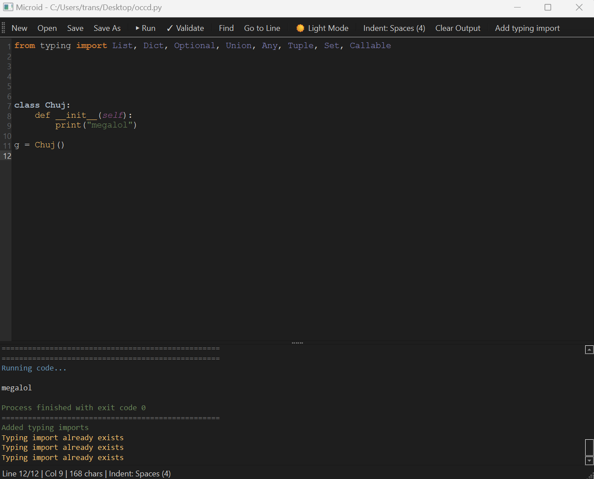

# Microid

A minimalistic Python editor with full indentation handling support. IDLE but better and faster. Ideal for working with AI-generated code.



## Features

- **Smart Indentation**: Auto-detects tabs vs spaces, maintains consistency, smart Enter/Backspace behavior
- **Syntax Highlighting**: Full Python syntax coloring matching PyCharm's Darcula theme
- **Type Hints**: Full support for type annotations, auto-insert return types, typing module integration
- **Code Execution**: Run code with F5, view output in integrated console
- **Syntax Validation**: Check for errors with F6 without running code
- **Autocomplete**: Context-aware suggestions for functions, classes, variables, keywords, type hints
- **Jump to Definition**: Ctrl+Click to navigate to function/class definitions
- **Go to Line**: Ctrl+G to quickly jump to any line number
- **Statistics**: Real-time display of current line, column, total lines, and character count
- **F-String Support**: Proper highlighting of f-strings and embedded expressions

## Installation

```bash
pip install PySide6
python python_editor.py
```

## Keyboard Shortcuts

| Key | Action |
|-----|--------|
| **Ctrl+N** | New file |
| **Ctrl+O** | Open file |
| **Ctrl+S** | Save |
| **Ctrl+Shift+S** | Save as |
| **F5** | Run code |
| **F6** | Validate syntax |
| **Ctrl+G** | Go to line |
| **Ctrl+Click** | Jump to definition |
| **Tab** | Indent |
| **Shift+Tab** | Dedent |
| **Esc** | Close autocomplete |

## Why Microid?

- **Perfect for AI code**: Handles any indentation style from Claude, ChatGPT, Copilot
- **Fast**: Instant startup, no bloat
- **Smart**: Auto-detects indent type/size from existing code
- **Visual feedback**: Cursor changes on Ctrl hover, line highlighting on jump
- **Type hint ready**: Built-in support for modern Python type annotations

## Usage

Open or paste AI-generated code and Microid automatically adapts to the indentation style. Press F5 to run, F6 to validate. Use Ctrl+Click to navigate through functions and classes.

## Requirements

- Python 3.7+
- PySide6
